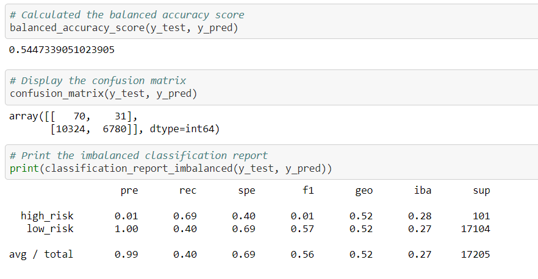

# Credit_Risk_Analysis

## Overview
The objective is to find the best supervised machine learning model to asses credit card risk. Given a dataset, the idea is to determine which model would provide the best assessment in determining credit card risk level based on several factors.

## Results

### Naive random oversampling

* Balanced Accuracy: 64.7%
* Precision(High-Risk): 1%
* Precision(Low-Risk): 100%
* Sensitivity(High-Risk): 69%
* Sensitivity(Low-Risk): 60%

### SMOTE oversampling

* Balanced Accuracy: 66.2%
* Precision(High-Risk): 1%
* Precision(Low-Risk): 100%
* Sensitivity(High-Risk): 63%
* Sensitivity(Low-Risk): 69%

### Cluster centroid undersampling

* Balanced Accuracy: 54.4%
* Precision(High-Risk): 1%
* Precision(Low-Risk): 100%
* Sensitivity(High-Risk): 69%
* Sensitivity(Low-Risk): 40%

### SMOTEENN sampling

* Balanced Accuracy: 64.7%
* Precision(High-Risk): 1%
* Precision(Low-Risk): 100%
* Sensitivity(High-Risk): 69%
* Sensitivity(Low-Risk): 60%

### Balanced random forest classifier

* Balanced Accuracy: 68.3%
* Precision(High-Risk): 88%
* Precision(Low-Risk): 100%
* Sensitivity(High-Risk): 37%
* Sensitivity(Low-Risk): 100%

### Easy Ensemble AdaBoost Classifier

* Balanced Accuracy: 93.1%
* Precision(High-Risk): 9%
* Precision(Low-Risk): 100%
* Sensitivity(High-Risk): 92%
* Sensitivity(Low-Risk): 94%

## Summary

I would choose the Easy Ensemble AdaBoost Classifier model to perform this credit risk analysis.

To understand the level of risk, we need a model that misses the least amount of high risk loans. This can be obtained from the sensitvity(or recall) metric. The models that have the highest sensitivity for high risk is the Easy Ensemble AdaBoost Classifier, with the SMOTEENN Sampling Model and the Naive random oversaampling model having significantly lower sensitivity to high risk but higher than the rest of the models. 

The other metric that plays a role in deciding which model to use is the sensitivity for low risk as this shows the amount of low risk laons that are falsely predicted to be high risk. The models that had the best sensitivity to low risk scores is once again, the Easy Ensemble AdaBoost Classifier. 

Given that the accuracy score of the Easy Ensemble AdaBoost Classifier model is 93.1%, it shows that this model generally performs well.

A combination of these three ideas leads me to conclude that the Easy Ensemble Classifier model is relatively the best model to use for this dataset, and similar ones in the future to predict credit risk.
