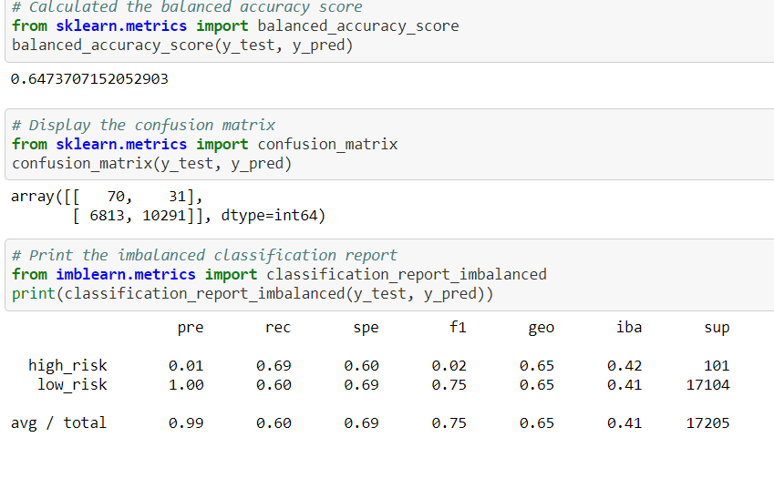
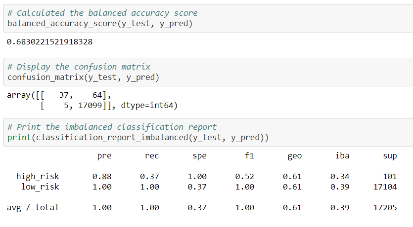
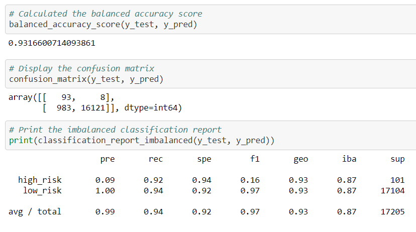

# Credit_Risk_Analysis

## Overview

The objective is to asses credit card risk. Given a dataset, the idea is to determine which superivsed machine-learning model would provide the assessment in determining credit card risk level based on several factors.

## Results

### Naive random oversampling

* Balanced Accuracy: 64.7%
* Precision(High-Risk): 1%
* Precision(Low-Risk): 100%
* Sensitivity(High-Risk): 69%
* Sensitivity(Low-Risk): 60%

### SMOTE oversampling

* Balanced Accuracy: 66.2%
* Precision(High-Risk): 1%
* Precision(Low-Risk): 100%
* Sensitivity(High-Risk): 63%
* Sensitivity(Low-Risk): 69%

### Cluster centroid undersampling

* Balanced Accuracy: 54.4%
* Precision(High-Risk): 1%
* Precision(Low-Risk): 100%
* Sensitivity(High-Risk): 69%
* Sensitivity(Low-Risk): 40%

### SMOTEENN sampling

* Balanced Accuracy: 64.7%
* Precision(High-Risk): 1%
* Precision(Low-Risk): 100%
* Sensitivity(High-Risk): 69%
* Sensitivity(Low-Risk): 60%

### Balanced random forest classifier

* Balanced Accuracy: 68.3%
* Precision(High-Risk): 88%
* Precision(Low-Risk): 100%
* Sensitivity(High-Risk): 37%
* Sensitivity(Low-Risk): 100%

### Easy Ensemble AdaBoost Classifier

* Balanced Accuracy: 93.1%
* Precision(High-Risk): 9%
* Precision(Low-Risk): 100%
* Sensitivity(High-Risk): 92%
* Sensitivity(Low-Risk): 94%

## Summary
